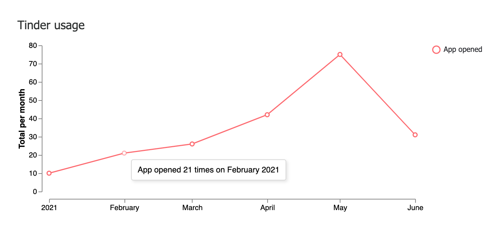
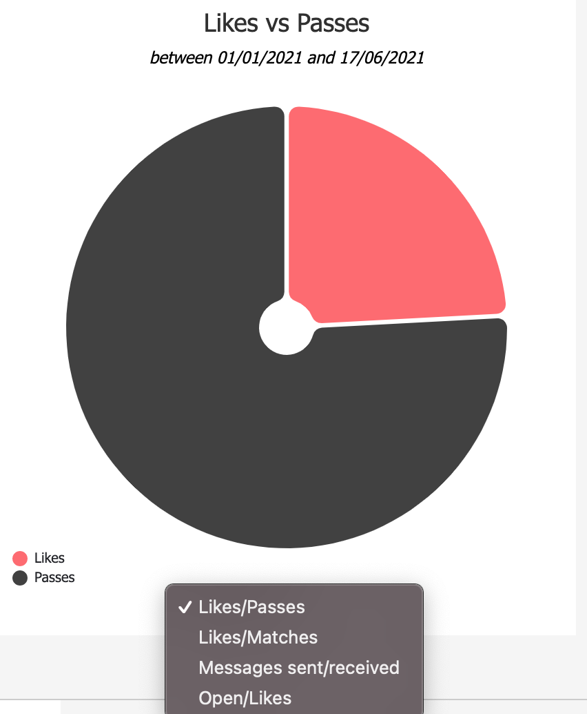

# Tinder visualisations
## Data format
> Theses Vega configuration files expects the following JSON format:

| date | like | pass | number_of_messages_received | open | number_of_superlike | number_of_match | number_of_messages_sent |
|---|---|---|---|---|---|---|---|
| 2021-11-14 | 3 | 13 | 3 | 13 | 3 | 13 | 3 | 

> A full example of the data is under `data.json`

## Screenshot

